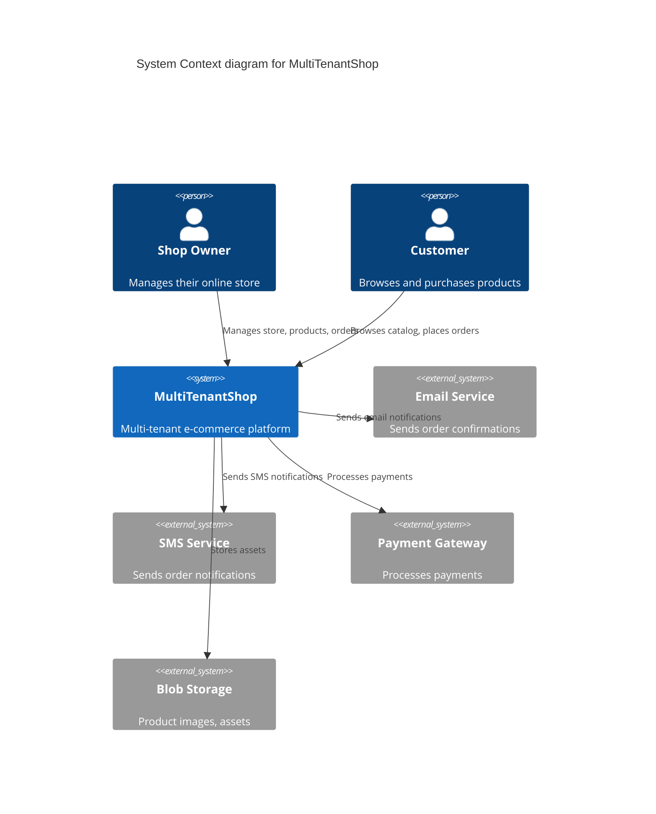
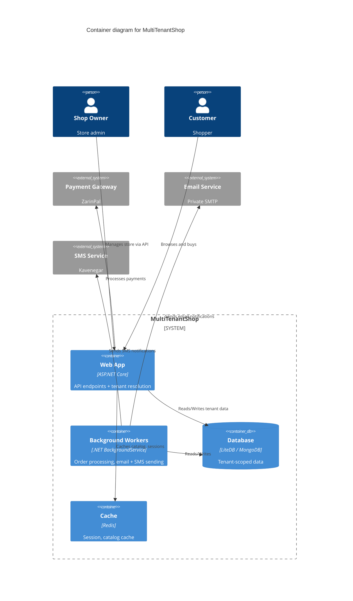
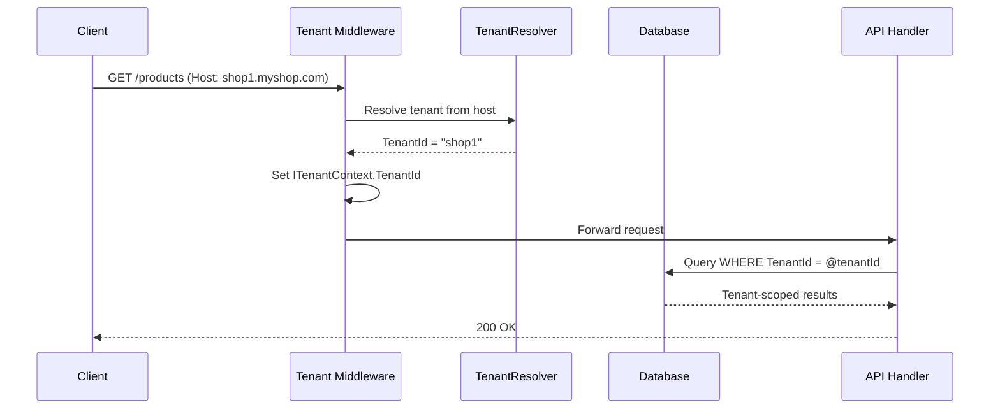
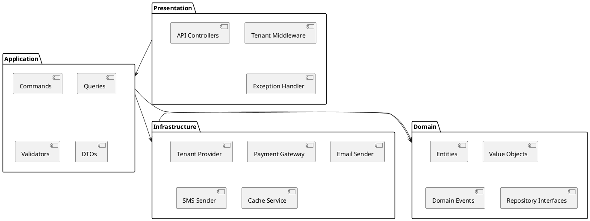

# Architecture Overview

```mermaid
C4Context
  title System Context diagram for MultiTenantShop

  Person(shopOwner, "Shop Owner", "Manages their online store")
  Person(customer, "Customer", "Browses and purchases products")
  System(mts, "MultiTenantShop", "Multi-tenant e-commerce platform")
  System_Ext(email, "Email Service", "Sends order confirmations")
  System_Ext(sms, "SMS Service", "Sends order notifications")

  System_Ext(payments, "Payment Gateway", "Processes payments")
  System_Ext(storage, "Blob Storage", "Product images, assets")

  Rel(shopOwner, mts, "Manages store, products, orders")
  Rel(customer, mts, "Browses catalog, places orders")
  Rel(mts, email, "Sends email notifications")
  Rel(mts, sms, "Sends SMS notifications")
  Rel(mts, payments, "Processes payments")
  Rel(mts, storage, "Stores assets")
```

## Container Diagram

```mermaid
C4Container
  title Container diagram for MultiTenantShop

  Person(shopOwner, "Shop Owner", "Store admin")
  Person(customer, "Customer", "Shopper")

  System_Boundary(mts, "MultiTenantShop") {
    Container(web, "Web App", "ASP.NET Core", "API endpoints + tenant resolution")
    Container(background, "Background Workers", ".NET BackgroundService", "Order processing, email + SMS sending")
    ContainerDb(db, "Database", "LiteDB / MongoDB", "Tenant-scoped data")
    Container(cache, "Cache", "Redis", "Session, catalog cache")
  }

  System_Ext(payments, "Payment Gateway", "ZarinPal")
  System_Ext(email, "Email Service", "Private SMTP")
  System_Ext(sms, "SMS Service", "Kavenegar")

  Rel(shopOwner, web, "Manages store via API")
  Rel(customer, web, "Browses and buys")
  Rel(web, db, "Reads/Writes tenant data")
  Rel(web, cache, "Caches catalog, sessions")
  Rel(web, payments, "Processes payments")
  Rel(background, db, "Reads/Writes")
  Rel(background, email, "Sends email notifications")
  Rel(background, sms, "Sends SMS notifications")
```

## Tenant Resolution Flow

```mermaid
sequenceDiagram
    participant C as Client
    participant MW as Tenant Middleware
    participant TR as TenantResolver
    participant DB as Database
    participant API as API Handler

    C->>MW: GET /products (Host: shop1.myshop.com)
    MW->>TR: Resolve tenant from host
    TR-->>MW: TenantId = "shop1"
    MW->>MW: Set ITenantContext.TenantId
    MW->>API: Forward request
    API->>DB: Query WHERE TenantId = @tenantId
    DB-->>API: Tenant-scoped results
    API-->>C: 200 OK
```

## Component Diagram (PlantUML)

```plantuml
@startuml
package "Presentation" {
  [Tenant Middleware]
  [API Controllers]
  [Exception Handler]
}

package "Application" {
  [Commands]
  [Queries]
  [Validators]
  [DTOs]
}

package "Domain" {
  [Entities]
  [Value Objects]
  [Domain Events]
  [Repository Interfaces]
}

package "Infrastructure" {
  [Tenant Provider]
  [Payment Gateway]
  [Email Sender]
  [SMS Sender]
  [Cache Service]
}

Presentation --> Application
Application --> Domain
Infrastructure --> Domain
Application --> Infrastructure
@enduml
```
