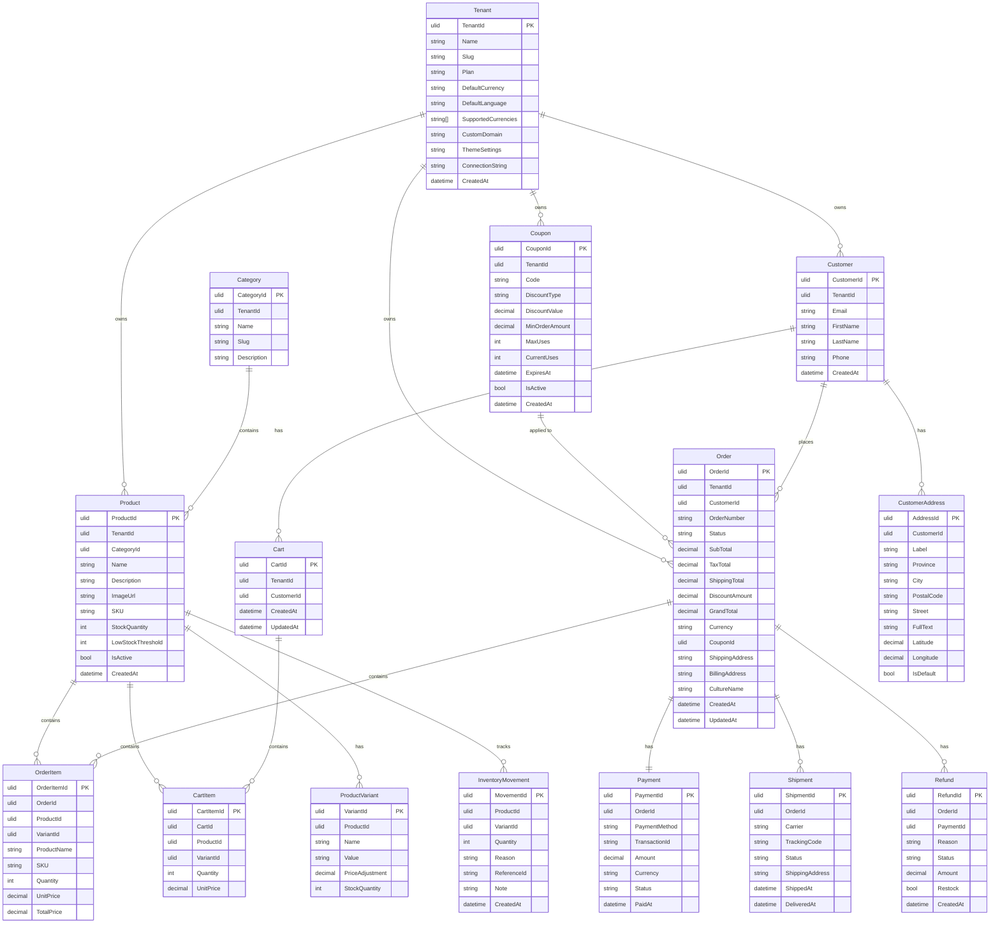
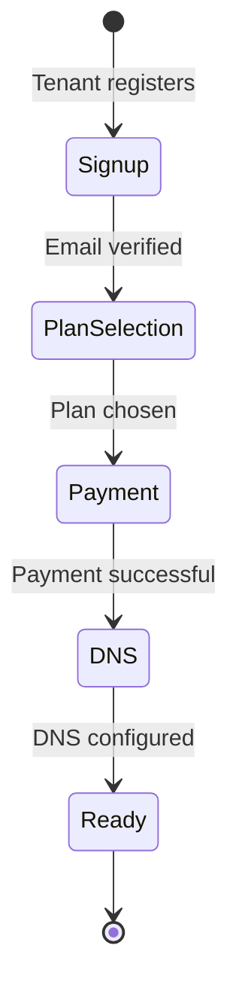
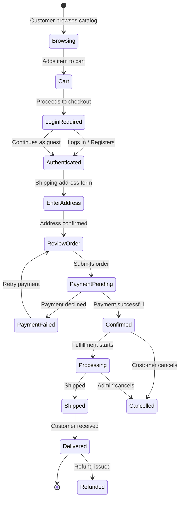
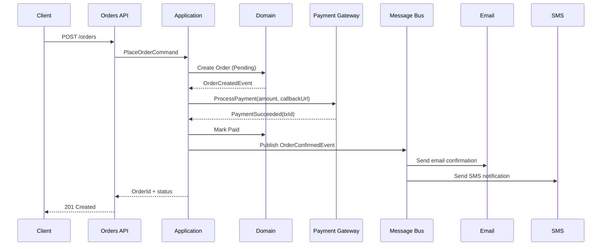
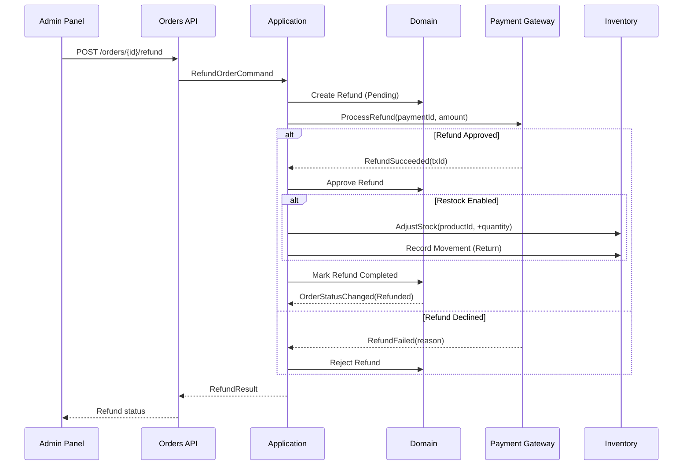

# Domain Model

> Document DB model (LiteDB / MongoDB). PK/FK markers in diagrams represent logical document references, not database constraints.

## Entity Relationship Diagram



## Tenant Document (stored in shared DB)

```json
{
  "_id": "a1b2c3d4",
  "slug": "acme-corp",
  "name": "Acme Corporation",
  "plan": "Professional",
  "defaultCurrency": "USD",
  "defaultLanguage": "en",
  "supportedCurrencies": ["USD", "EUR", "GBP"],
  "customDomain": "acme.myshop.com",
  "themeSettings": {
    "primaryColor": "#ff6600",
    "logoUrl": "https://cdn.myshop.com/acme/logo.png",
    "fontFamily": "Inter"
  },
  "connectionString": null,
  "createdAt": "2026-06-25T00:00:00Z"
}
```

## Domain Class Diagram (PlantUML)

```plantuml
@startuml
package "Tenant Boundary" {
  class Tenant {
    - TenantId: ulid
    - Name: string
    - Slug: string
    - Plan: string
    - DefaultCurrency: string
    - DefaultLanguage: string
    - SupportedCurrencies: List~string~
    - CustomDomain: string
    - ThemeSettings: string
    - ConnectionString: string
    - CreatedAt: DateTime
  }

  interface ITenantScoped {
    + TenantId: ulid
  }
}

package "Catalog Context" {
  class Product {
    - ProductId: ulid
    - TenantId: ulid
    - Name: string
    - Prices: List~Money~
    - Sku: string
    - StockQuantity: int
    - LowStockThreshold: int
    + AdjustStock(int quantity, string reason)
    + GetPrice(string currency): Money
    + IsLowStock(): bool
  }

  class Money {
    - Amount: decimal
    - Currency: string
    + Add(Money other): Money
    + Multiply(decimal factor): Money
    + ConvertTo(targetCurrency, rate): Money
  }

  class Category {
    - CategoryId: ulid
    - Name: string
    - Slug: string
  }

  class ProductVariant {
    - VariantId: ulid
    - Name: string
    - Value: string
    - PriceAdjustment: Money
  }

  Product "1" --> "*" ProductVariant
  Product "*" --> "1" Category
  Product ..|> ITenantScoped
  Product *--> "*" Money : prices
}

package "Inventory Context" {
  class InventoryMovement {
    - MovementId: ulid
    - ProductId: ulid
    - VariantId: ulid
    - Quantity: int
    - Reason: MovementReason
    - ReferenceId: string
    - Note: string
    - CreatedAt: DateTime
  }

  enum MovementReason {
    Purchase
    Sale
    Adjustment
    Return
    Transfer
  }

  Product "1" --> "*" InventoryMovement
}

package "Order Context" {
  class Order {
    - OrderId: ulid
    - TenantId: ulid
    - OrderNumber: string
    - Status: OrderStatus
    - Items: List~OrderItem~
    - DiscountAmount: Money
    - CouponId: ulid
    + AddItem(Product, int)
    + CalculateTotal(): Money
    + ApplyCoupon(Coupon): DiscountResult
    + Submit()
    + Cancel()
  }

  enum OrderStatus {
    Pending
    Confirmed
    Processing
    Shipped
    Delivered
    Cancelled
    Refunded
  }

  class OrderItem {
    - ProductId: ulid
    - ProductName: string
    - Quantity: int
    - UnitPrice: Money
  }

  Order "1" --> "*" OrderItem
  Order ..|> ITenantScoped
  Order *--> Money
}

package "Payment Context" {
  class Payment {
    - PaymentId: ulid
    - OrderId: ulid
    - Method: PaymentMethod
    - TransactionId: string
    - Amount: Money
    - Status: PaymentStatus
  }

  enum PaymentMethod {
    ZarinPal
  }

  enum PaymentStatus {
    Pending
    Completed
    Failed
    Refunded
    PartiallyRefunded
  }

  Payment *--> Money
}

package "Promotion Context" {
  class Coupon {
    - CouponId: ulid
    - TenantId: ulid
    - Code: string
    - DiscountType: DiscountType
    - DiscountValue: decimal
    - MinOrderAmount: Money
    - MaxUses: int
    - CurrentUses: int
    - ExpiresAt: DateTime
    - IsActive: bool
    + CanApply(Order): bool
    + CalculateDiscount(Order): Money
  }

  enum DiscountType {
    Percentage
    Fixed
  }

  Coupon ..|> ITenantScoped
}

package "Cart Context" {
  class Cart {
    - CartId: ulid
    - Items: List~CartItem~
    + AddProduct(Product, int)
    + RemoveProduct(ProductId)
    + Clear()
    + CalculateTotal(): Money
  }

  class CartItem {
    - ProductId: ulid
    - ProductName: string
    - Quantity: int
    - UnitPrice: Money
  }

  Cart "1" --> "*" CartItem
  Cart *--> Money
}

package "Customer Context" {
  class Customer {
    - CustomerId: ulid
    - TenantId: ulid
    - Email: string
    - FirstName: string
    - LastName: string
    - Phone: string
    - Addresses: List~Address~
    + GetDefaultAddress(): Address
  }

  class Address {
    - Label: string
    - Province: string
    - City: string
    - PostalCode: string
    - Street: string
    - FullText: string
    - Latitude: decimal
    - Longitude: decimal
    + Format(bool persian): string
  }

  Customer *--> "*" Address
  Customer ..|> ITenantScoped
}

package "Fulfillment Context" {
  class Shipment {
    - ShipmentId: ulid
    - OrderId: ulid
    - Carrier: string
    - TrackingCode: string
    - Status: ShipmentStatus
    - ShippingAddress: Address
    - ShippedAt: DateTime
    - DeliveredAt: DateTime
  }

  enum ShipmentStatus {
    Pending
    PickedUp
    InTransit
    Delivered
    Failed
  }

  class Refund {
    - RefundId: ulid
    - OrderId: ulid
    - PaymentId: ulid
    - Reason: string
    - Status: RefundStatus
    - Amount: Money
    - Restock: bool
    - CreatedAt: DateTime
  }

  enum RefundStatus {
    Pending
    Approved
    Rejected
    Completed
  }

  Order "1" --> "*" Shipment
  Order "1" --> "*" Refund
  Shipment *--> Address
  Refund *--> Money
}

hide empty members
@enduml
```



## Key Workflows

### Tenant Onboarding



### Order Placement Flow



### Payment Processing



### Refund Flow


