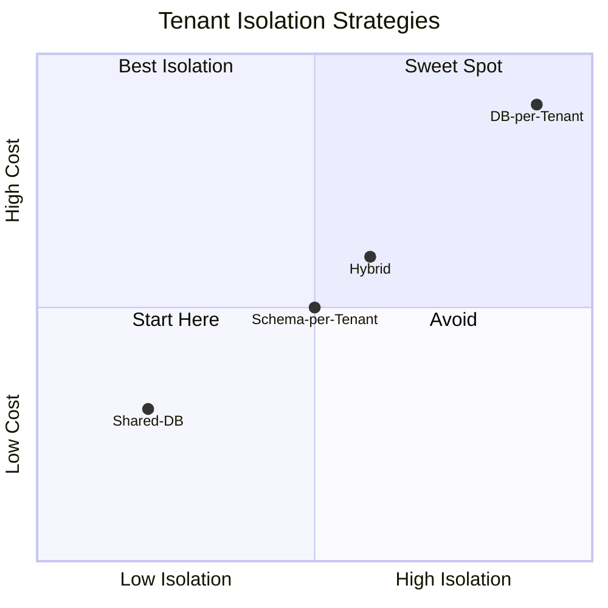
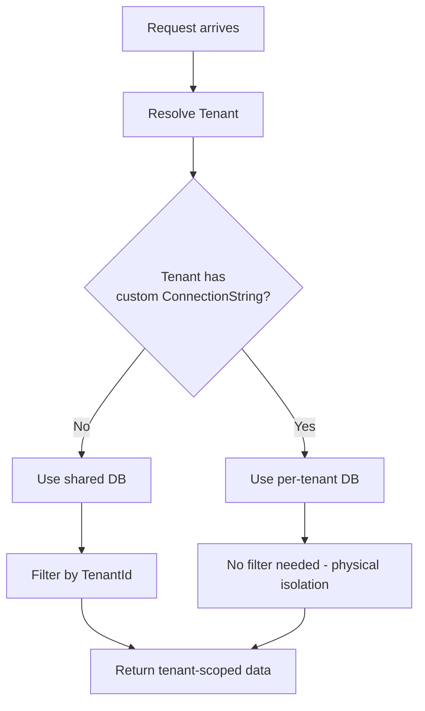
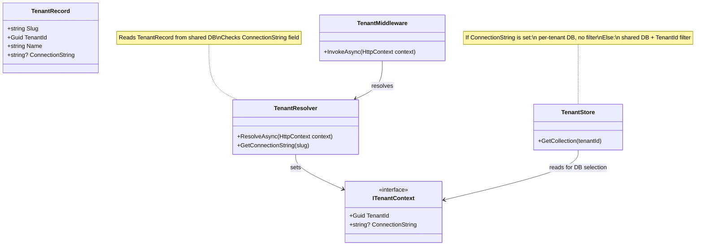
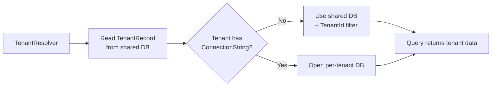
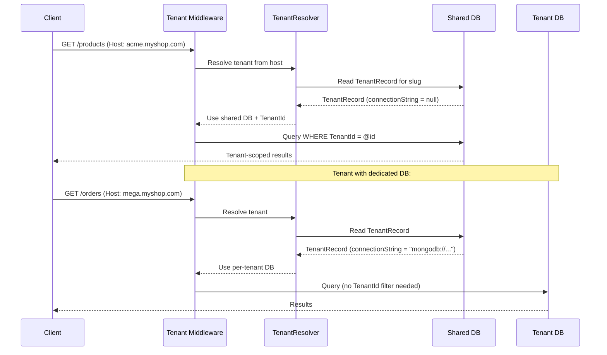

# Multi-Tenancy Strategy

## Options Comparison



## Decision

**Default: Shared DB with TenantId** — opt-in per-tenant databases via connection string stored in the shared DB.

## Dual-Mode Strategy



**How it works:**

| Mode | Trigger | Behavior |
|---|---|---|
| **Shared DB** (default) | Tenant record has null `ConnectionString` | Single database, every document has `TenantId`, queries filter by it |
| **DB-per-Tenant** (opt-in) | Tenant record has a `ConnectionString` value | Separate database for that tenant, no tenant filter needed |

## Per-Tenant Connection Strings in the Shared DB

Only two environment variables exist:

```bash
DatabaseProvider=LiteDB                          # or MongoDB
ConnectionStrings__Default=Filename=Data/MultiTenantShop.db
```

The shared DB contains a `Tenants` collection. Each tenant record stores its own optional connection string:

```json
{
  "slug": "acme-corp",
  "tenantId": "a1b2c3d4-...",
  "name": "Acme Corporation",
  "connectionString": null
},
{
  "slug": "mega-store",
  "tenantId": "e5f6g7h8-...",
  "name": "Mega Store Inc.",
  "connectionString": "mongodb://megastore-db:27017/megastore"
}
```

On startup the app reads the `Tenants` collection from the shared DB. Tenants with a `connectionString` get their own database. Tenants with null share the default DB.

**Adding or moving a tenant** = insert/update a document in the `Tenants` collection. No restart required.

## Tenant Resolution Flow

### Component Overview



### Connection Resolution Logic



### Sequence



```plantuml
@startuml
skinparam componentStyle rectangle

package "Tenant Resolution" {
  [TenantMiddleware] --> [TenantResolver]
  [TenantResolver] --> [ITenantContext]
  note left of [TenantResolver]
    Strategies:
    - Host header (shop1.myshop.com)
    - X-Tenant-Id header
    - Path prefix (/shop1/api/...)

    Reads TenantRecord from shared DB
    Checks ConnectionString field
  end note
}

package "Data Access" {
  [TenantStore] --> [ITenantContext]
  [Repository] --> [TenantStore]
  note right of [TenantStore]
    If ConnectionString is set -->
      separate DB, no filter
    Else --> shared DB + TenantId filter
  end note
}

package "Domain" {
  interface "ITenantScoped" {
    + Guid TenantId
  }
  class "Product" {
    + Guid TenantId
  }
  class "Order" {
    + Guid TenantId
  }
}

ITenantScoped <|.. Product
ITenantScoped <|.. Order
@enduml
```

## Tenant Isolation per Database

| Strategy | LiteDB | MongoDB |
|---|---|---|
| **Shared DB** (default) | Single `.db` file, documents include `TenantId` field, queries filter by it | Single database, `TenantId` field on every document |
| **Per-tenant** (opt-in) | Separate `.db` file per tenant | Separate database per tenant |

## Resolved Questions

- **Self-service provision?** No — tenants are provisioned by platform admins only.
- **Tenant-specific themes/branding?** Yes — each tenant can customize their storefront theme and branding. Approach: Tailwind CSS variables scoped via `TenantShopLayout`, admin panel unchanged. See [tech-stack.md](tech-stack.md#tenant-theming-approach).
- **Cross-tenant reporting?** Not for tenants. Cross-tenant admin views are available to platform admins only.
- **Tenant onboarding flow:** `Signup → Choose plan → Pay → Setup DNS → Ready` — DNS maps to the tenant's shop front (e.g., `acme.myshop.com`). The admin panel is on our domain (e.g., `admin.multitenantshop.com`) and shared by all tenants.
