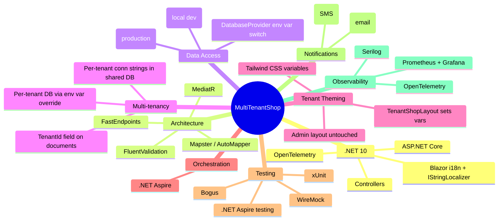

# Technology Stack

> **Status:** Decisions marked with 🟡 are still open for discussion.

## Stack

| Layer | Technology | Status |
|---|---|---|
| **Runtime** | .NET 10 (ASP.NET Core) | ✅ |
| **API Style** | Controllers | ✅ |
| **i18n** | Blazor built-in localization + `IStringLocalizer` | ✅ |
| **Database Driver** | LiteDB (local dev) / MongoDB.Driver (production) | ✅ |
| **Database** | LiteDB (embedded, local dev) / MongoDB (production) — switchable via `DatabaseProvider` env var | ✅ |
| **Cache** | Redis | ✅ |
| **Message Bus** | RabbitMQ | ✅ |
| **Payments** | ZarinPal SDK | ✅ |
| **Notifications** | Private SMTP (email), Kavenegar (SMS) | ✅ |
| **Frontend** | Blazor Web App — static SSR (default), Auto for authenticated pages | ✅ |
| **Storage** | MinIO (local dev) / Liara Object Storage (production) | ✅ |
| **Auth** | ASP.NET Core Identity + Cookies | ✅ |
| **Testing** | xUnit + .NET Aspire | ✅ |
| **CI/CD** | GitHub Actions | ✅ |
| **Container / Orchestration** | .NET Aspire | ✅ |

## Key Library Candidates



## Tenant Theming Approach

Each tenant can customize their shop front's look via `ThemeSettings` stored in their Tenant document. The admin panel always uses our fixed theme.

**Tailwind CSS variables approach:**

```js
// tailwind.config.js
theme: {
  extend: {
    colors: {
      primary:  'var(--color-primary)',
      bg:       'var(--color-bg)',
      text:     'var(--color-text)',
    }
  }
}
```

**Blazor layout resolves theme per-tenant:**

```razor
@* TenantShopLayout.razor *@
@inject ITenantContext Tenant

<div class="tenant-theme" style="@GetThemeVariables()">
    @Body
</div>

@code {
    string GetThemeVariables() =>
        $"--color-primary: {Tenant.ThemeSettings.PrimaryColor};" +
        $"--color-bg: {Tenant.ThemeSettings.BackgroundColor};" +
        $"--color-text: {Tenant.ThemeSettings.TextColor};";
}
```

**Compiled CSS is shared** — one `app.css` built from Tailwind. The CSS variables cascade from the `.tenant-theme` wrapper, keeping the admin panel (which uses our fixed theme via `MainLayout`) unaffected.

## Open Questions
